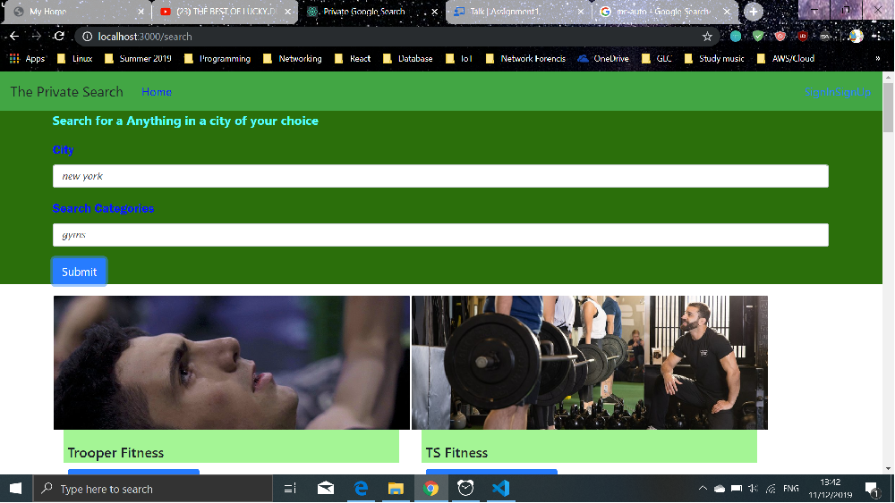
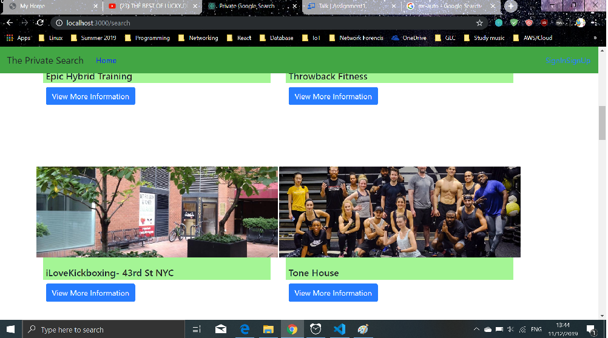
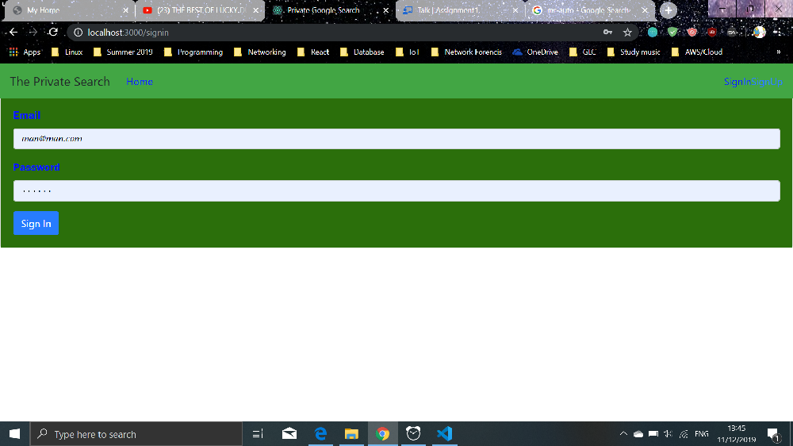
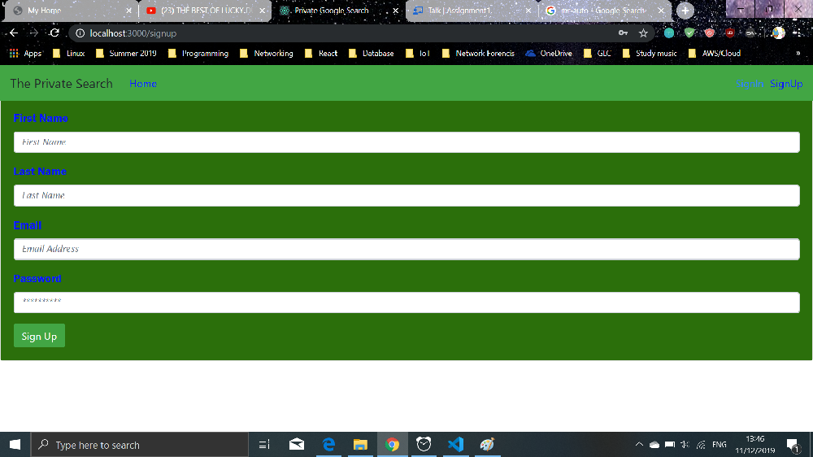
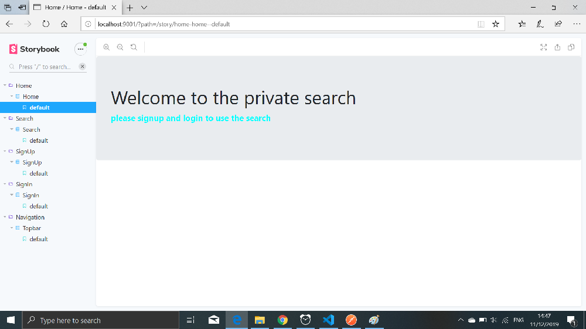
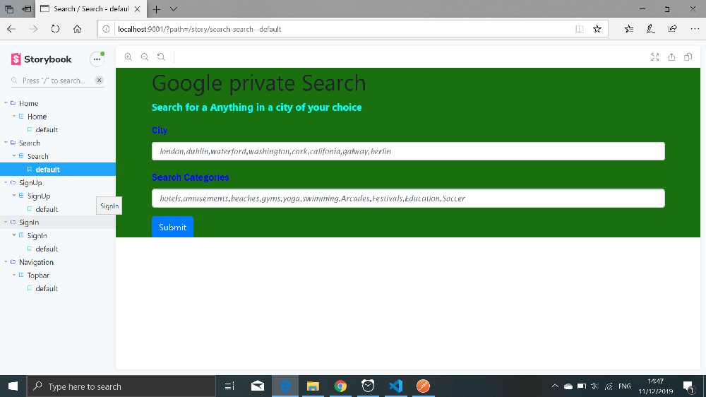

<<<<<<< HEAD
# BSc (Hons.) Level 8 - Assignment 1 - Single Page app.

Name: Manzi Joseph

## Overview.

This app is like a google search, so you first type in the location which is the city you want to search in and the 
you add in the category of what your looking to search e.g hotels,amusements,gyms and many more.the results are queried using yelp api search api 

- Feature 1: Sign In
- Feature 2: Sign Up
- Feature 3: Search
- Feature 4: Signout
- Feature 5 : not working unfornunatly CRUD

## UI Design.

There is a card for each results.and it have a button which is clickable for you to view more information

just require your email and password which is saved in firebase

here you register and then be able to use our search

## Routing.

- /signin 
- /signup
- /signout
- /search

## Storybook.

## Sample screenshoot

## Bugs
once you sign in 

=======
# ReactFAssignment
react first assignmet
>>>>>>> 278b56ff1b100f47f142ab69c2f9adeaa0451f5b
